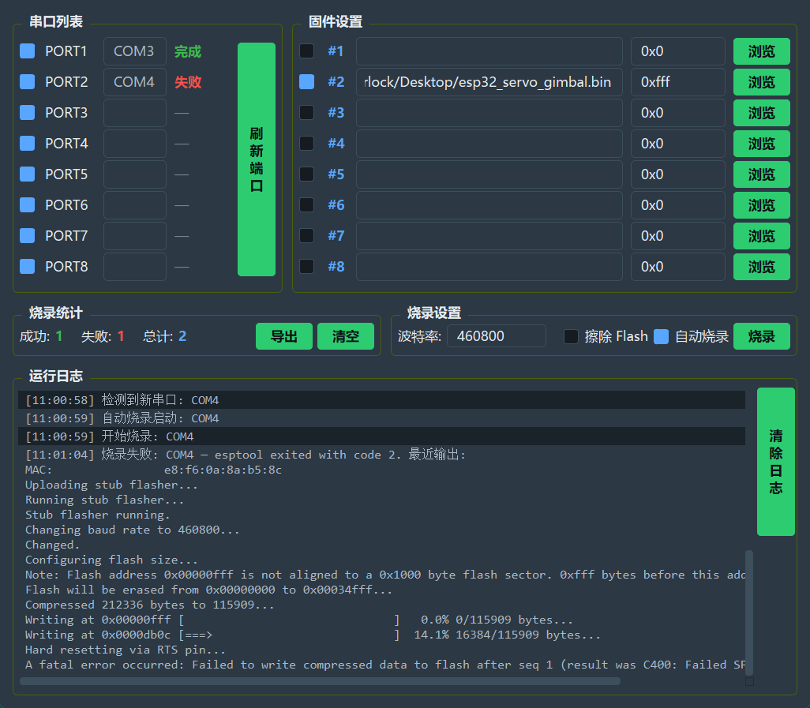
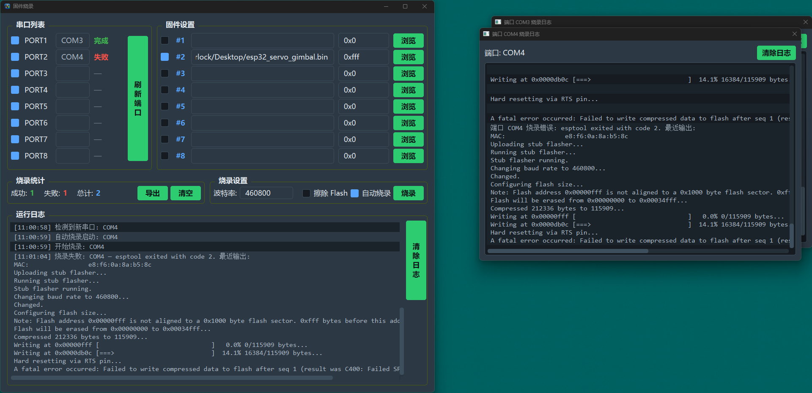
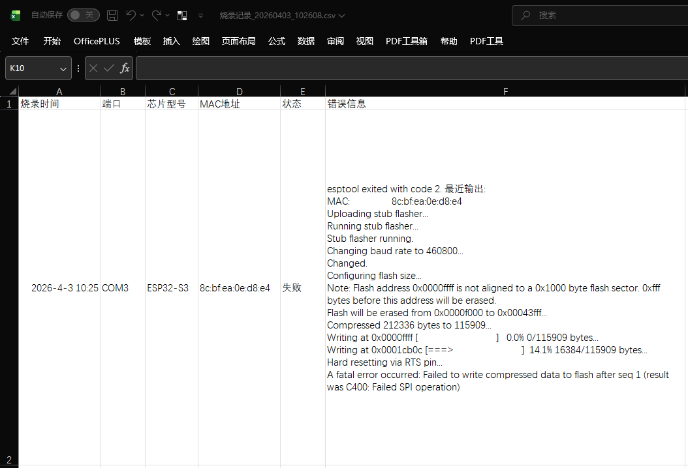

# ESP32 Firmware Batch Flashing Tool (PyQt6)

A desktop tool for factory lines and batch scenarios: **parallel multi-port flashing for the ESP32 family**. Built with **PyQt6**, it stays smooth under heavy logging and long-running tasks, and makes it easy to copy, export, and trace runs.

[](https://www.python.org/)
[](https://www.riverbankcomputing.com/software/pyqt/)
[](https://www.microsoft.com/windows)

---
[English](README-en.md) | [中文](README.md)
---
## Thanks for Your Star
- If you like this tool, please give it a Star ⭐

## Feature Overview

- **Multi-serial parallel flashing**: up to **8 channels** at the same time, with independent progress and logs.
- **Automatic chip detection**: matches target parameters for ESP32 / S2 / S3 / C2 / C3 / C6 / H2 / H4 / P4 / 8266 and others based on esptool detection results.
- **Multiple firmware partitions**: configurable groups of `.bin` files and flash addresses to support common layouts such as bootloader, partition table, and application.
- **Auto-flash mode**: starts automatically when devices are ready, suitable for plug/unplug workflows on a production line.
- **Erase Flash**: optional full-chip erase before writing.
- **Selectable baud rates**: supports settings up to **2000000** (depends on USB and cable quality).
- **Persistent configuration**: firmware paths, baud rate, options, etc. are saved automatically and loaded next time.
- **Per-port logs**: one log window per serial port. Close a window to cancel that channel task and release the serial port. Closing the main window ends all flashing.
- **Flashing statistics & export**: success/failure counts; export **CSV** including time, port, chip, MAC, status, and error details.

---

## Highlights

### UI

- **Dark theme + QSS**: eye-friendly colors, dark backgrounds, outlined group areas, customized scrollbars; clear partitioning for more comfortable long-term monitoring.
- **Fusion styling**: stable on Windows with style sheets, avoiding incomplete drawing and abnormal spacing for main window controls.
- **Read-only log text areas** in the main window and port log windows: supports selection and **Ctrl+C** to copy the entire log block, making it easy to paste into work orders or bug reports.
- **Cascaded layout for port log windows**: staggered offsets next to the main window in the order you open them, reducing full overlap.
- **Buttons & controls**: adapted for the interaction between Windows style sheets and native buttons (e.g., solid fill backgrounds; avoiding border-only outlines).

### UI Screenshots







### Packaging & Run

- **Single-file exe (PyInstaller onefile) friendly**: a dedicated entry **`__ESP32_PYQT_ESPTOOL__`**; the subprocess only runs the `esptool` command line, **so it won’t** spawn another GUI main window.
- You can still use `python -m esptool` for source debugging, consistent with normal development workflow.
- **Subprocesses on Windows**: you can create the esptool subprocess without a console window to reduce extra black windows (behavior depends on system policies).

### Configuration & Icons

- **Config location**: when packaged as an exe, `config.json` is written to the **same directory as the exe** instead of the temporary extraction folder, avoiding config loss on every run.
- **Icon**: prefer loading from the same directory or bundled resources such as `app_exe.ico`. If needed on Windows, fall back to reading the Shell icon from **the exe itself**, and apply it again after the first frame to improve title bar and taskbar display.

### Logging & Troubleshooting

- **CSV export**: **UTF-8 with BOM**, which Excel can open directly. Failed records include an **error details** column.
- **Failure details**: when esptool exits with a non-zero code, the **last few lines of console output** are written into the error notes, making it easier to correlate with the exported table for troubleshooting rather than showing only the numeric exit code.

### Other

- **High DPI**: enable `HighDpiScaleFactorRoundingPolicy.PassThrough` to reduce blur and misalignment when using multiple monitors (depends on OS/Qt versions).
- **One-click packaging script `build.bat`**: uses **UTF-8 BOM**, **CRLF**, correct `pip` quoting, and `DisableDelayedExpansion` to avoid garbled text or command line splitting when double-clicking the batch file.

---

## Supported Chips

Consistent with the official `esptool` supported range, including but not limited to:

| Chip model | Notes |
|------------|-------|
| ESP32 / ESP32-S2 / ESP32-S3 | Common |
| ESP32-C2 / C3 / C6 | RISC-V family, etc. |
| ESP32-H2 / ESP32-P4 and others | Depends on actual detection and esptool |
| ESP8266 | Other |
---

## Quick Start

### Requirements

- Python **3.8+**
- Windows (packaging scripts and icon strategy mainly target Windows; source can be tried on other systems)

### Install Dependencies

```bash
cd esp32-flash-tool-pyqt
pip install -r requirements.txt
```

### Run (from Source)

```bash
python main.py
```

### Build to Exe

1. Place **`app_exe.ico`** into the project directory (same as `ICON_PATH` in `build.bat`).
2. Run **`build.bat`** (recommended to save the batch file as **UTF-8 with BOM** and use **CRLF** line endings).
3. Output: `dist\esp32_flasher_pyqt.exe`

The packaging command adds `--icon` and `--add-data` for `onefile`, so icon resources can be resolved at runtime.

---

## Project Structure (Brief)

```
esp32-flash-tool-pyqt/
├── main.py              # Program entry and UI/business logic
├── requirements.txt     # Dependencies
├── build.bat            # One-click packaging with PyInstaller
├── app_exe.ico          # Icon (you must provide your own)
├── config.json          # Generated after running (do not bundle into the exe)
└── README.md            # This document
```

---

## Dependencies

| Library | Purpose |
|---------|---------|
| PyQt6 | Graphical user interface |
| esptool | Flashing and device communication |
| pyserial | Serial port enumeration and release |
| pyinstaller | Packaging (optional; installed by build.bat) |


---

## Troubleshooting

| Symptom | Recommendation |
|---------|------------------|
| Double-clicking `build.bat` causes garbled text / commands split | Save `build.bat` as **UTF-8 with BOM** and use **CRLF** line endings |
| A second main window appears after packaging | Keep the dedicated esptool subprocess entry inside the program; do not change it to launch `python -m esptool` directly with the same GUI executable |
| Serial port is still busy | Close the corresponding port log window or the main window; if needed, unplug and replug the device |

---

## License

**MIT License** (if this directory provides a `LICENSE` file, follow that file).

---

## Acknowledgements

- [esptool](https://github.com/espressif/esptool)  
- [PyQt](https://www.riverbankcomputing.com/software/pyqt/)  
- [PyInstaller](https://pyinstaller.org/)

---

**Note**: This documentation is synchronized with the current `main.py` implementation. If the program is updated but the document is not, the code takes precedence.
